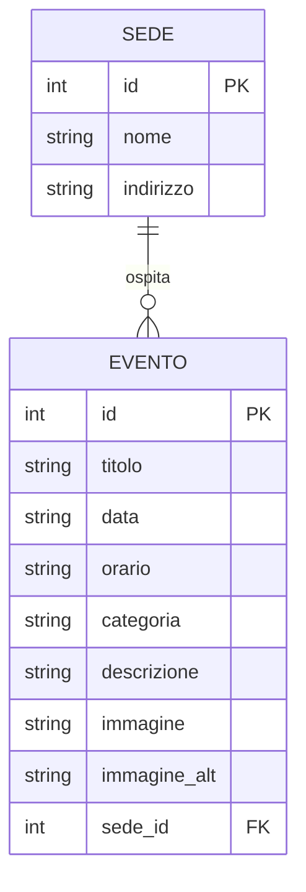

```mermaid
erDiagram
    SEDE ||--o{ EVENTO : "ospita"
    SEDE {
        int id PK
        string nome
        string indirizzo
    }
    EVENTO {
        int id PK
        string titolo
        string data
        string orario
        string categoria
        string descrizione
        string immagine
        string immagine_alt
        int sede_id FK
    }
```
